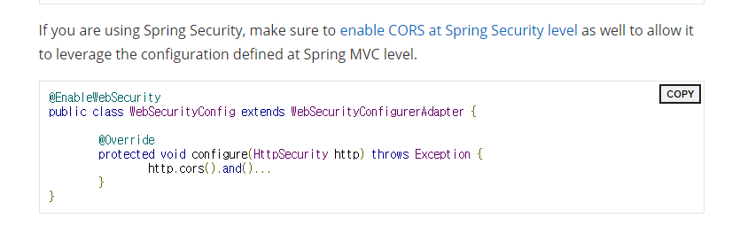

### 작성 이유

스프링으로 처음하는 백엔드 프로젝트에서 프론트 하는 친구에게 CORS 에러가 발생했다는 연락을 받았다. 

내가 로컬 서버, test 서버에서는 문제가 없었으나, 프론트에서는 문제가 생겼다. 

문제 해결을 위해 여러 곳에서 서칭하다가 원인과 해결방법을 찾았고, 이곳에 기록해놓기로 하였다.

<br>

### CORS란

> Access to XMLHttpRequest at '주소A' from origin '주소B' has been blocked by CORS policy: No 'Access-Control-Allow-Origin' header is present on the requested resource.

Cross-Origin Resource Sharing 의 줄임말
교차 출처 리소스 공유를 의미
<br>

**Origin** <br>
웹에서 Origin은 간단하게 프로토콜, 주소, 포트번호의 튜플로 구분된다.

> Origin = [프로토콜]://[Host의 IP 주소 또는 URL]:[포트번호]

즉, 아래의 셋 중 하나라도 다르다면 다른 Origin이다.<br>

1.프로토콜(HTTP, HTTPS, FTP, ...)<br>
2.URL(a.com, b.com, cat.co.kr, ...)<br>
3.포트번호(80, 433, 8080, ...) 

cf. HTTP는 포트 번호가 80번, HTTPS는 포트 번호가 443번

<br>

#### 1. 동일 출처 정책(Same-Origin Policy, SOP)<br>
대부분의 웹 브라우저는 Same Origin Policy(SOP)라는 보안 정책을 준수하며, 같은 출처만 허용한다는 정책<br>
내가 접속한 사이트(Origin)에서 다른 Origin에 요청한 것을 기본적으로 제한해서 어느정도 해커의 공격에 방어하는 것이다.<br><br>
다른 Origin에서 온 자원들을 모두 사용할 수 없게 차단했다면 
CDN과 같은 것을 사용하기 어려웠을 것이다. <br>
그래서 `, <script>, <link>, <iframe>`과 같은 특정 HTML Tag는 
다른 Origin으로부터 온 것은 임베딩할 수 있게 허용해준다. 
(임베딩만 가능하고 데이터를 읽는 건 보안상의 이유로 차단한다.) <br><br>
하지만 우리는 개발하다보면 다른 Origin으로부터의 자원을 불러오고 싶은 경우가 많다. <br>
그렇기 때문에 CORS(Cross Origin Resource Sharing)이라는 것이 생겼다. <br>
다른 Origin의 데이터를 읽고 싶으면 CORS 표준을 지켜서 내 사이트로부터의 응답에 
"다른 Origin이더라도 허용해줘!" 라고 말해주면 된다.

#### 2. 교차 출처 리소스 공유( Cross-Origin Resource Sharing, CORS)?<br>
SOP가 우리가 더 안전하게 웹을 탐색할 수 있게하지만 의도적으로 다른 리소스랑 상호작용하면서 개발하고 싶은 경우에는 너무 제한적이다. 
내가 이해한 바로는 그럴 때 써라고 만든게 CORS이다. SOP를 좀 완화해준 느낌?<br><br>
CORS를 사용해서 하나의 Origin만 읽는게 아니라 내가 명시한 다른 신뢰 가능한 Origin으로부터 받은 리소스를 읽어들이는 법에 관해 알아보자.
<br><br>
++ 참고로 CORS Request는 Simple Request일 수도 있고 Preflight Request일 수도 있다.
> Preflight Request의 경우
  다른 Origin 요청을 보낼 때 미리 내 요청을 받을 수 있는지 확인하기 위해서 사전 요청(Preflight Request)을 보낸다. 그러고 나서 가능하면 나의 실제 요청을 보내고 응답을 받는다.

🔽 Simple Request인 경우 <br>
예비 요청을 보내지 않고 서버에게 바로 본 요청을 보낸 후, 응답 헤더의 Access-Control-Allow-Origin 값을 확인하여 CORS 정책 위반 여부를 확인 <br>
* 요청이 아래와 같을 때 <br>
  ✔ 요청의 메소드는 GET, HEAD, POST 중 하나여야 한다.<br>
  ✔ Accept, Accept-Language, Content-Language, Content-Type, DPR, Downlink,
       Save-Data, Viewport-Width, Width를 제외한 헤더를 사용하면 안 된다.<br>
  ✔ 만약 Content-Type를 사용하는 경우에는 application/x-www-form-urlencoded,
       multipart/form-data, text/plain만 허용된다.<br>

1. 이 경우에는 브라우저가 받은 요청이 어떤 Origin에서 시작됐는지 헤더를 추가한다.
2. 서버는 받은 CORS 요청이 유효한지 아닌지 Access-Control-Allow-Origin 헤더로 응답해준다.

🔽 Preflight Request인 경우 <br>
일반적으로 사용하는 방식으로, 브라우저는 요청을 한 번에 보내지 않고 예비 요청과 본 요청으로 나누어서 서버로 전송 <br>
이때 예비 요청은 OPTIONS 메소드를 사용하여 본 요청을 보내기 전에, 브라우저 스스로 이 요청이 안전한지 확인하는 역할 <br>
* 요청이 아래와 같을 때<br>
  ✔ Simple Request가 아닌 경우
  
<br>

### CORS 오류 해결방법(in spring)

#### 1. Spring MVC에서 설정 방법

Spring MVC에서 CORS를 적용하는 방법은 크게 2가지로 <br>
컨트롤러에서 @CrossOrigin 어노테이션을 사용해서 설정하는 방법<br>
전역적으로 Spring MVC 설정에서 CORS를 설정하는 방법 <br>

##### 1) 전역적인 방법
WebMvcConfigurer을 implements받아 WebConfig에서 전역적으로 cors를 설정해줌

```java
@Configuration
@EnableWebMvc
public class WebConfig implements WebMvcConfigurer {


        @Override
        public void addCorsMappings(CorsRegistry registry) {
            registry.addMapping("/**")
                    .allowedOriginPatterns("*")
                    .allowedMethods("*")
                    .allowedHeaders("*")
                    .allowCredentials(true)
                    .maxAge(3600);


        }
}
```

괄호안에 "*" : wildcard로 어떤 것이든 허용

1.스프링부트 2.4.0버전부터 allowCredentials가 true일때 allowedOrigins에 ("*") 값을 추가 할 수 없게됨 <br>
->allowedOrigins를 allowedOriginPatterns로 변경 (WebConfig.class)

2.axios사용시 프론트 단에서도 allowCredentials를 true해줘야한다 <br>
아직 axios에대해 정확하게 알지는 못하지만 프론트에서 axios를 사용할때 allowCredential을 허용해줘야하는데 백에서뿐만아니라 프론트에서도 허용을 하니 cors에러가 사라졌다.

3.1,2번 문제해결후 회원가입은 정상적으로 작동했으나 로그인은 계속 cors문제가 발생하였다. <br>
원인은 로그인 후 request응답 헤더에 Origin, Access-Control-Request-Method,Access-Control-Request-Headers이 빠져있었음 <br>
공식문서에 따르면 "springsecurity사용시 security 수준에서 cors설정해줘야한다"라고함 <br>
->spring security 사용시 추가 설정필요 (필터단에서 처리필요)



##### 2) Controller에 추가

controller마다 `@CrossOrigin `어노테이션을 활용해준다. <br>
`@CrossOrigin` 애노테이션을 통해 origins, methods, allowedHeaders, exposedHeaders, allowCredentials, maxAge 모두 설정할 수 있다. <br>
그러나 이는 controller가 늘어날수록 controller마다 설정해야한다는 단점이 있다.

<br>

#### 2. spring security에서 해결 방법

이번에 내가 선택한 방법. 우리가 하는 spring project가 스프링 security를 사용하고 있으므로 세번째 방법을 선택했다. <br>
Spring security 사용시, 1번의 방법은 이용 불가.

순서1)`SecurityConfig`에 CORS 설정 추가

원래 SecurityConfig에 JWT 설정이 있어서 그 앞에 CORS 설정 추가해줬다. 
```java
@Bean
public SecurityFilterChain securityFilterChain(HttpSecurity http, JwtProvider jwtProvider) throws Exception {
  http
    .csrf(AbstractHttpConfigurer::disable)
    // CORS 설정 추가
    .cors(cors -> cors.configurationSource(corsConfigurationSource()))
    .httpBasic(AbstractHttpConfigurer::disable)
    .sessionManagement(sessionManagement -> sessionManagement.sessionCreationPolicy(STATELESS))
    .authorizeHttpRequests((authorizeHttpRequests) 
      // authorization ...
    )
    .addFilterBefore(new JwtAuthenticationFilter(jwtProvider), UsernamePasswordAuthenticationFilter.class);

  return http.build();
}
```

순서2)`CorsConfigurationSource` 추가 

CorsConfigurationSource 만들어준다. 
```java
@Bean
public CorsConfigurationSource corsConfigurationSource() {
  CorsConfiguration config = new CorsConfiguration();

  // *는 모든 것 허용. 추후 상황에 따라 수정 가능
  config.addAllowedOriginPattern("*");
  config.addAllowedHeader("*");
  config.addAllowedMethod("*"); // "GET", "POST", "PUT", "DELETE", "PATCH", "OPTIONS", "HEAD", "TRACE"
  config.setExposedHeaders(Arrays.asList("Authorization", "Authorization-refresh"));
  config.setAllowCredentials(true);

  UrlBasedCorsConfigurationSource source = new UrlBasedCorsConfigurationSource();
  source.registerCorsConfiguration("/**", config);
  return source;
}
```
setAllowCredentials(true); : json 서버 응답을 자바스크립트에서 처리할 수 있게 해줌 <br>
addAllowedOriginPattern("*");	: allowCredentials 를 true로 설정해주었다면, 보안 정책상 allowedOrigins("*")는 불가능. 그럼에도 모든 요청에 대한 허용을 하고 싶다면 allowedOriginPatterns("*")를 이용 <br>
setExposedHeaders(Arrays.asList("Authorization", "Authorization-refresh")); : 응답 헤더 추가

이때 반드시 `Authentication Filter`보다 앞에 `CorsFilter`를 추가해주어야 한다.

#### 결론

스프링 시큐리티를 사용하지 않은 경우 전역적으로 CORS 설정을 하면 된다.

스프링 시큐리티를 사용한 경우에는 새로운 CORS 필터를 빈으로 생성한 후 addFilter()를 통해 등록하거나, <br>
CorsConfigurationSource를 구현하는 익명 클래스를 생성하고 .cors() 메서드에 등록하여야 한다.

<br>

### 참고자료
내가 찾은 CORS Error의 올바른 해결법<br>
<https://coding-groot.tistory.com/91>

spring boot cors에러 해결(Spring security,react)<br>
<https://velog.io/@ojin0104/spring-boot-cors%EC%97%90%EB%9F%AC-%ED%95%B4%EA%B2%B0Spring-securityreact>

axios요청 후 커스텀 header값 못 읽는 문제해결 방법(JWT)<br>
<https://lollaziest.tistory.com/230>

[Trouble Shooting] Spring Security를 사용하여 CORS 에러 해결방법<br>
<https://dangdangee.tistory.com/entry/Trouble-Shooting-Spring-Security%EB%A5%BC-%EC%82%AC%EC%9A%A9%ED%95%98%EC%97%AC-CORS-%EC%97%90%EB%9F%AC-%ED%95%B4%EA%B2%B0%EB%B0%A9%EB%B2%95>

Spring Security Cors Mapping Error<br>
<https://gowoonsori.com/blog/error/springsecurity-cors/>

[Spring Security] CORS 설정 시 응답 헤더 없는 오류<br>
<https://ksh-coding.tistory.com/73>
